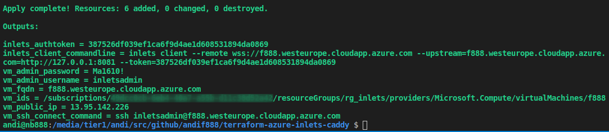

# Guacamole inlets Exit-Node on Azure

This repo uses terraform to deploy an inlets exit-node on Azure fully unattended. 
If you are currious about what is an inlets exit-node, then please read the Intro at [https://github.com/inlets/inlets](https://github.com/inlets/inlets).  

This is right for you, if you want to publish a webserver, which is inside your internal, corporate network, but you neither have a public static IP addresse, nor want to deal with some kind of DynDNS and port forwardings on your internet router.

An inlets exit-node is a cheap Linux VM in Azure (roughly 8 Euros per month) with a public IP address and a valid full qualified domain name.  
Your internal Webserver connects to the inlets exit-node using a SSL secured Websocket connection (this is an outbound connection from the point of view of your internal webserver). 
If someone enters the full qualified domain name of the inlets exit-node in the address bar of a webbrowser, the exit-node forwards the request to your internal webserver using the Websocket tunnel in reverse.

If your internal webserver is [Apache Gacamole](https://guacamole.apache.org), which is a HTML5 based clientless remote desktop gateway, then your are able to connect to any Windows machine on your corporate network using any webbrowser.

## Pre-Requesites

Make sure your have [Azure CLI](https://docs.microsoft.com/en-us/cli/azure/install-azure-cli) installed.  
Make sure your have [Terraform](https://learn.hashicorp.com/terraform/getting-started/install.html) installed. 
Those to pre-requesites are already true, if you have already executed [install.sh](../install.sh) script the initial Step 1.

If you have never logged in with Azure CLI on the commandline, then please run the following command to authenticate your device.

```console
az login
```
Move to the [inlets-exit-node](inlets-exit-node) directory. If you have initially used the [install.sh](../install.sh), then directory is located at `/srv/workfromhome-with-inlets/inlets-exit-node`.

```console
cd /srv/workfromhome-with-inlets/inlets-exit-node
```


## Step 1: Create Azure Service Principal Account

To create an Azure Service Principal Account run the following commandline.   
Replace `your-azure-subscription-id` with your real Scription ID. To locate your Subscription ID log in to the [Azure Portal](https://portal.azure.com/) and type "Subscriptions" in the top search bar and click on **Subscriptions**. It should look something like *41dff0cb-6eb4-39a7-b95b-d41c28d92c41*. 
Feel free to also adjust the value of the `--name` attribute.

```bash
az ad sp create-for-rbac \
--name="terraform_inlets_sp" \
--role="Contributor" \
--scope="/subscriptions/your-azure-subscription-id" \
--sdk-auth \
> az_client_credentials.json
```

## Step 2: Configure Terraform environment variables for Azure Resource Manager

Run the [arm_env.sh](arm_env.sh) script.  
This Script asks you for the VM hostname, the admin username and the admin password.   
The information is populated into environment variables and written to a `terraform.tfvars` file.  
   
Additionally the Azure Service Principal information is read from the `az_client_credentials.json`, which has been generated in the previous step, and is also populated in a bunch of environment variables and written to the `terraform.tfvars` file.  
  
Terraform is picking up the `terraform.tfvars` file automatically in the later steps.

```bash
./arm_env.sh
```

## Step 3: Run terraform init

```bash
terraform init
```

## Step 4: Run terraform plan

```bash
terraform plan
```

## Step 5: Run terraform apply

```bash
terraform apply
```

## Step 6: Finished, keep the output

After terraform command has sucessfully finished, you get some green output values. 
Take a note of them. Maybe would like to store them for later use.  




